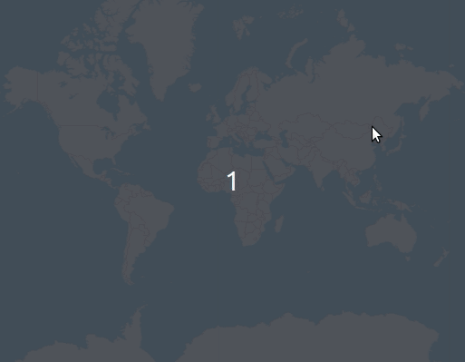

# react-leaflet-geodesic [](https://www.npmjs.com/package/react-leaflet-geodesic)

Draws geodesic curves on [React-Leaflet](https://github.com/PaulLeCam/react-leaflet), which are the real minimal "line" between two coordinates of the Earth.

This is a part-wrap of [Leaflet.Geodesic](https://github.com/henrythasler/Leaflet.Geodesic), made by henrythasler. There are some code still needed to get all functionalities from his lib, feel free to add it.



# Usage

```
import { Geodesic } from 'react-leaflet-geodesic'
...
const waypoints = [
  [-33, -70],
  [-33, 151],
]

const options = {
  weight: 20,
  opacity: 0.5,
  color: 'red',
}
...
<Geodesic positions={waypoints} options={options} />
...
```

For more details on how to use this plugin check the example.